# 🏦 2025长桥证券开户最新流程

转自：[CashCow](https://cashcow.click/finance/555/)

---

### ❔ 为什么投资港美股

*   港美股的市场公司治理和信息披露标准成熟，估值体系市场化，监管成熟。
*   T+0的交易制度，当天可以买入卖出，资金流动灵活。
*   AI 与云计算、芯片等科技板块增长迅速，特别是在美股市场，这些板块占比大、成长动力强。在AI热潮下，存在很多新的投资热点。
*   目前在美国的降息周期下，美国股票市场交投活跃，准备进入下一轮的大爆发。

---

### ❔ 为什么使用长桥证券

*   跟富途和老虎相比，长桥的佣金最低。长桥开户即可以享受终生免佣。对于低金额或小股数交易的单笔交易，免佣 + 较低最低费就能带来明显差异。
*   平台对用户服务更友好。上一年6月3日，纽交所因为软件问题，导致几只股票（包括伯克希尔-哈撒韦）价格出现极端错位，导致部分挂单用户出现巨额亏损。长桥是第一个，也是唯一明确表示亏损的用户被补偿，盈利用户保留收益的券商。
*   即使不持仓，资金存放在长桥也可以享受4%的利率。

---

### 📈 如何开户

#### 第一步：注册长桥账号

长桥有香港和新加坡两个主体。

如果你本身有香港银行卡的话，注册香港账户更方便，可以通过香港银行卡快速转账。

如果没有香港银行卡的话，我更建议注册新加坡的主体，新加坡主体的账户除了可以投资港美股之外，还可以参与新加坡股市，另外更重要的是，WISE钱包和新加坡账户之间的互转免手续费而且秒到账。

先在新加坡和香港账户中选择一个进行注册：

*   🇸🇬 **新加坡账户（推荐）：** [长桥证券（新加坡）注册链接](https://activity.longbridge.sg/pages/longbridge_sg/8650/index.html?app_id=longbridge_sg&org_id=1&channel=SHMB00007&account_channel=lb_sg&invite-code=4XWBUN)
*   🇭🇰 **香港账户：** [长桥证券（香港）注册链接](https://longbridge.activity.wbrks.com/pages/longbridge/8864/index.html?app_id=longbridge&org_id=1&channel=HM002025&account_channel=lb&invite-code=4XWBUN)

直接通过手机号验证码登录即可，未注册的长桥会为你自动创建账号。

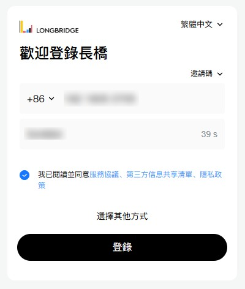

#### 第二步：点击立即开户

最好使用手机浏览器去操作，因为里面上传证件照片的时候需要用摄像头拍摄，不能从图册上传。

选择其他开户方式。

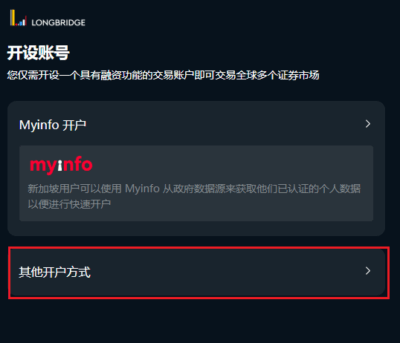
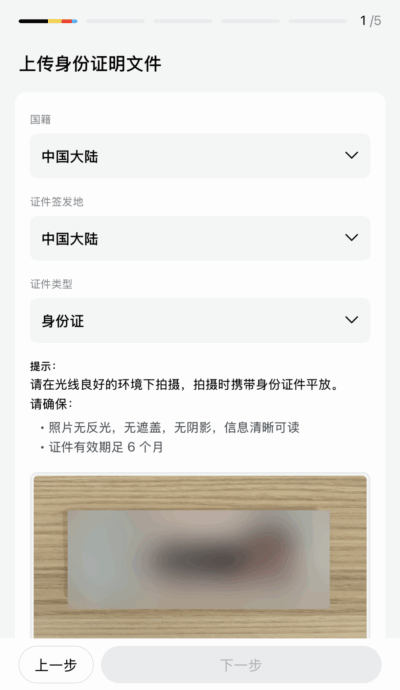

下面需要提交香港或国外的工作生活证明。

不知道账单长什么样子的朋友，这里有一个网站可以生成香港的水电费账单示例供参考。

大家参考看看水费单长什么就好。我一个朋友用它来生成水费单作为开户证明材料，最后还成功过审了，不过不太鼓励这种行为哈。😈

📃 **账单示例生成网站：** [香港账单示例生成](https://mimicland.click/)

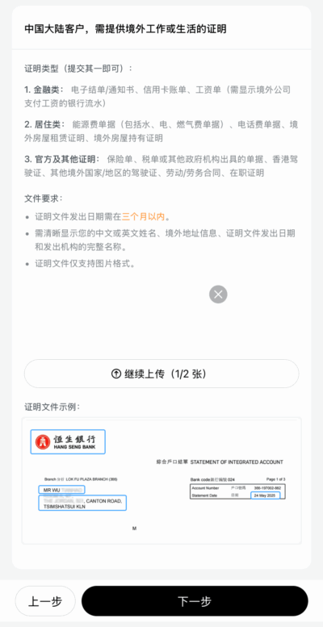
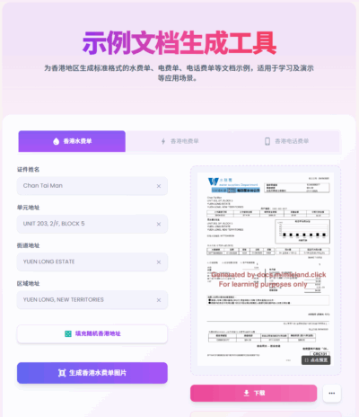

下一步填写个人基础信息，居住地址填写与工作生活证明上一致的地址，并上传对应的工作生活证明。

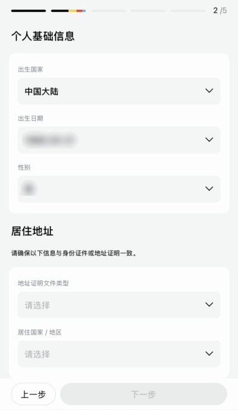
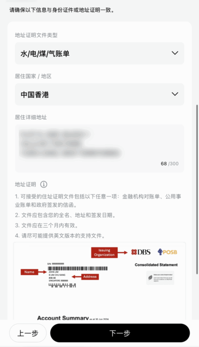

然后需要填写税务信息，没有香港税号的话，填写中国大陆税号即可（通常就是身份证号）。职业信息填写自己的公司信息即可。

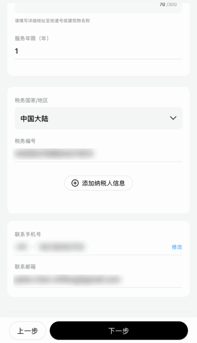
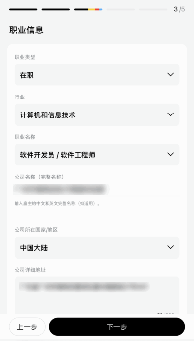

金融信息如实填写即可，一般都选择否。

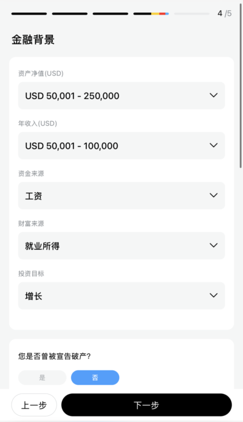
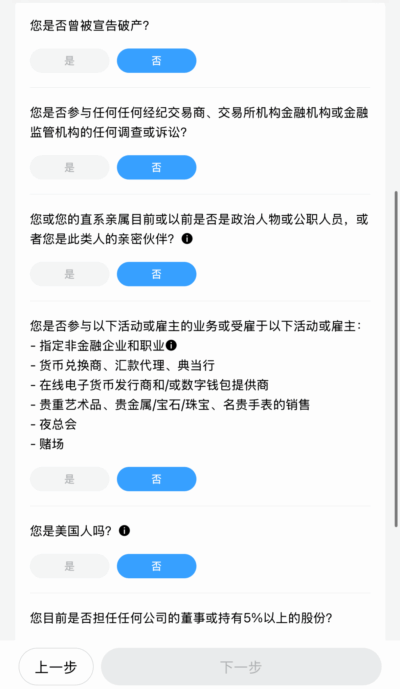
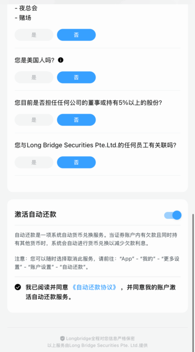

确认信息并提交之后，等待长桥审核即可。

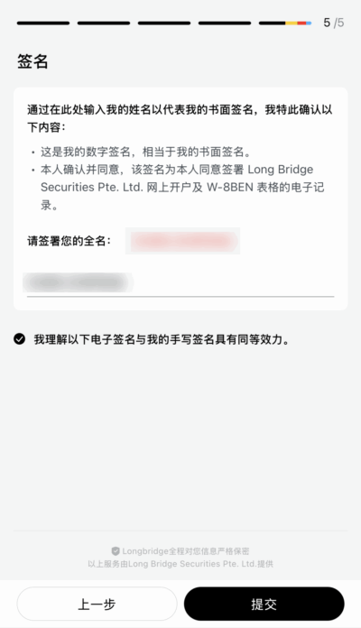
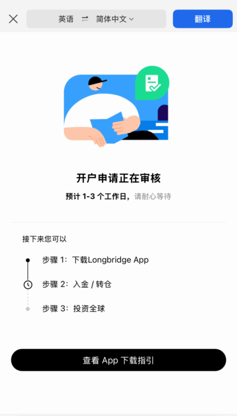

然后可以下载APP登录并等待审核结果通知，审核通过的话，你的邮箱应该会收到通知。

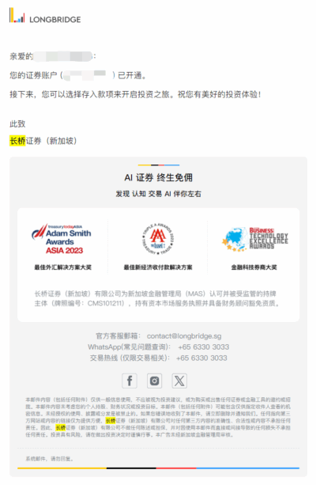

#### 第三步：开户之后如何入金

开户申请通过的话，应该在APP里面登录就可以看到自己的股票账户了。如果同时有香港和新加坡账户的话，在APP里面是可以切换的。

如果有香港银行卡的话，直接按照长桥的指引绑定银行卡即可。我这里主要针对没有香港银行卡的展开说一说。没有银行卡的话可以通过注册使用WISE来进行出入金。

---

### ❔ 什么是WISE

*   WISE 成立于 2011 年，总部在伦敦。初衷是解决国际汇款“手续费贵 +汇率差+流程慢”的问题。公司运营至今已发展为一家上市公司（在伦敦证券交易所），提供面向个人与企业的跨境汇款/多货币账户服务。费率透明、汇率好：不像传统银行那种隐藏汇率差价 + 多重手续费，WISE 明码标价，用的是真实中间汇率+明细手续费。汇款通常比银行快很多。
*   拥有一个WISE账号相当于拥有了多个银行账户，可以持有 40多种货币余额，在不同货币之间兑换，费用透明。有些货币能获得类似“本地银行帐号”功能，别人可以像当地一样把钱汇入这个帐号。比如wise新加坡币账号对应一个新加坡的银行账号，与长桥的新加坡账户之间的转账非常方便。
*   WISE之前一直不支持中国大陆居民注册，直到2025年4月30日开始，WISE终于开放中国大陆居民注册。

**WISE注册：** [立即注册 WISE 账户](https://wise.com/invite/dic/zhifengc28)

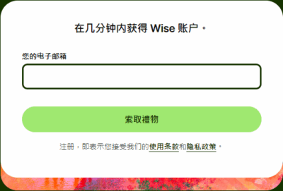

注册的时候选择个人账户即可。然后如实填写个人信息即可开通。WISE的账户开通之后即可以向里面转账。

转账可以选择使用不同的货币转账，但是使用人民币直接转账的限制比较多，只有中国境内的外籍人士才可以使用支付宝或者银行直接向WISE通过人民币账户充值，一般居民则无法使用这个方式。 所以我们可以选择通过美元或者港元来充值。

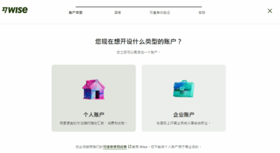
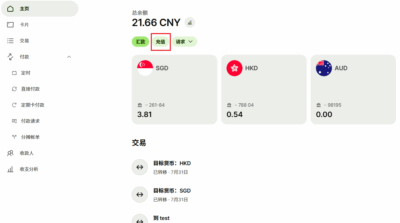
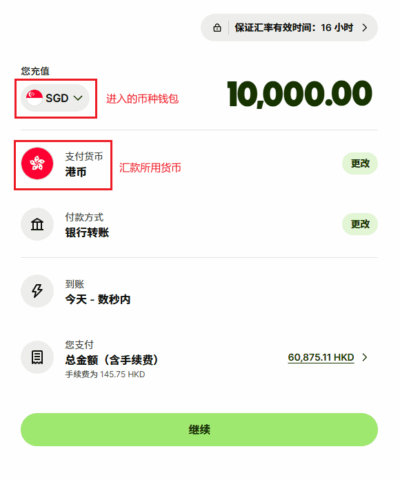

因为很多转账费用是固定的，所以建议不要拆分太多次转账，小额转账的话比较不划算。 不同的转账币种会有不同的渠道选择。 港元的话主要有银行直接转账或者FPS。国内银行可以先将人民币换汇转成港元，再通过汇款汇出。

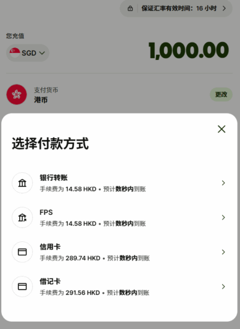

美元的话中国大陆主要可以通过国际电汇，或者信用卡（Visa、Mastercard 和 Maestro）来进行转账。

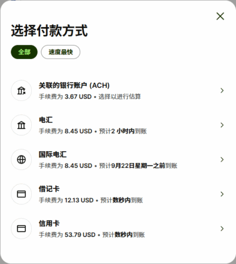

国际电汇的话比较慢，信用卡的话手续费比较高。这里还有另一个选择，通过数字货币+虚拟银行卡的方式向WISE转账，比较适合本身拥有数字货币的用户。（可以参看另一个帖子： [数字货币WISE充值教程](https://cashcow.click/finance/558/)）

往WISE充值完成后，查看WISE新加坡币账户的详细信息。

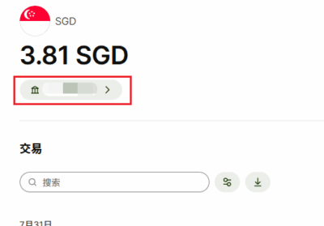

可以看到，WISE新加坡账户是一个新加坡的本地银行，因此向长桥的新加坡证券账户入金是不收取费用的，而且几分钟就可以到账。

回到长桥APP中，选择新加坡元入金，可以发现长桥是支持直接WISE入金的。在里面选择WISE Transfer，获得长桥WISE入金转账的账号。

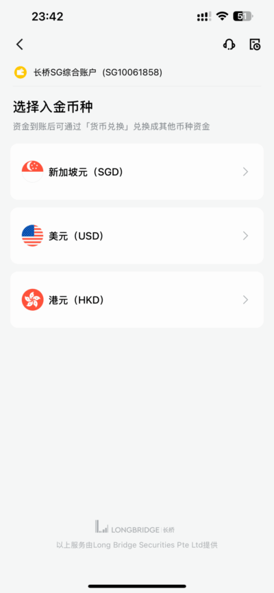
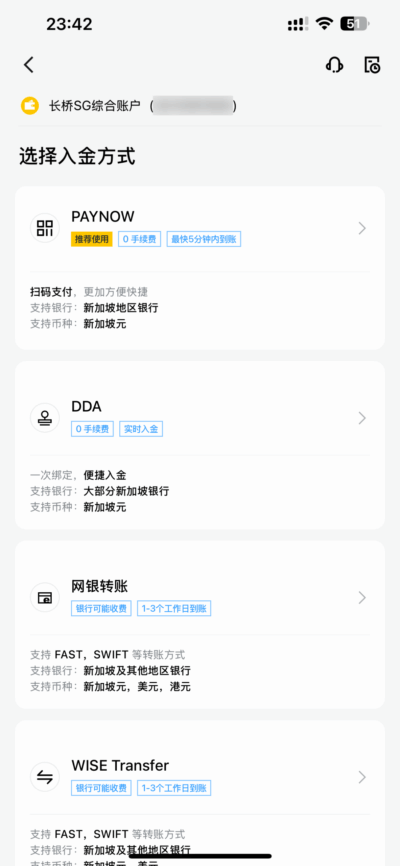
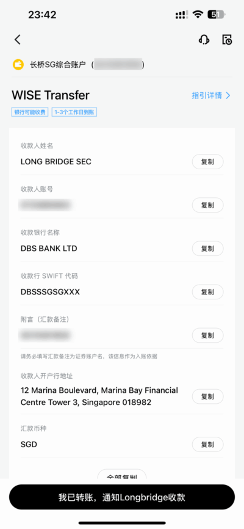

回到WISE中，选择汇款，填入长桥的WISE信息即可进行入金转账（转账时不要忘记填写汇款备注）。一般十分钟内就可以到账。

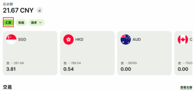

#### 第四步：如何出金

在长桥APP里面选择提取资金，然后绑定WISE里面提供给你的新加坡账号的信息填入，即可出金。出金的时效大概是1~2天。

---

### 相关链接

*   [🏦 2025富途证券开户最新流程](https://cashcow.click/finance/555/)
*   [🪙 通过数字货币给WISE账号充值教程](https://cashcow.click/finance/558/)

